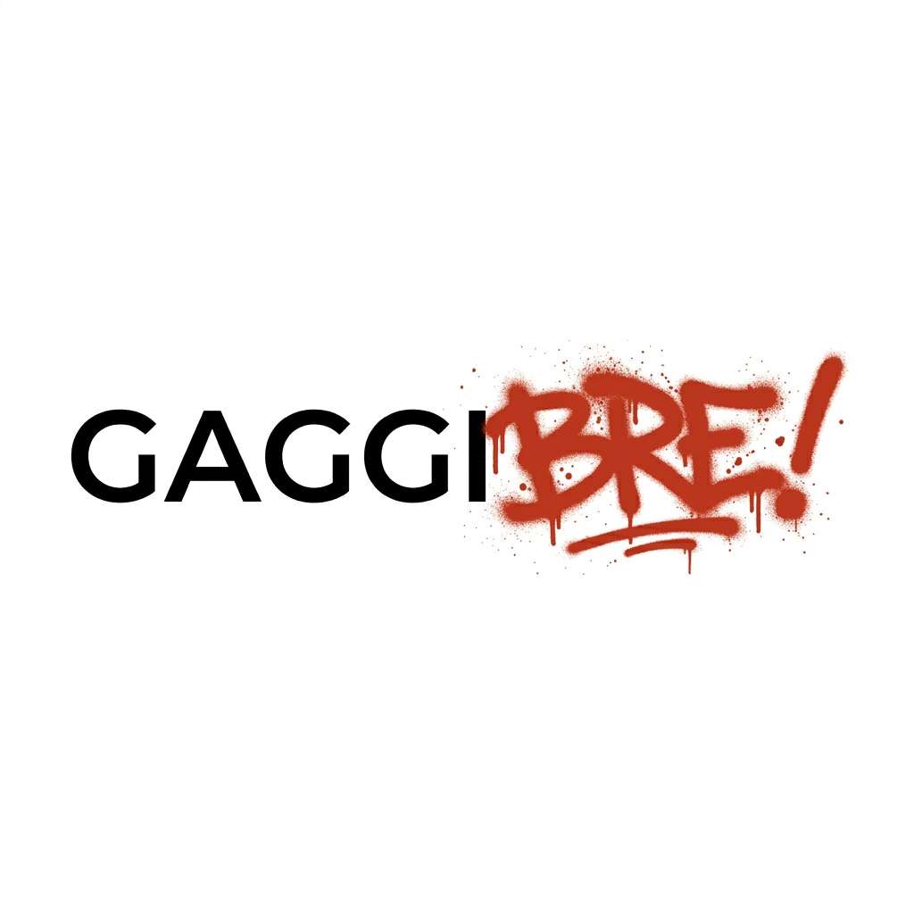

# GaggiBre

<p align="center">

<br />

[![CC BY-NC-SA 4.0][cc-by-nc-sa-shield]][cc-by-nc-sa]

</p>

**GaggiBre** is an open-source smart firmware for Gaggia espresso machines.

> **Why "Bre"?** *Bre* (pronounced "breh") is an ubiquitous, untranslatable Serbian interjection used as an intensifier — a "verbal exclamation mark" similar to informal English fillers like "come on," "bro," or "oh, brother." It adds emotional weight — urgency, camaraderie, or sheer enthusiasm — to whatever it follows. *GaggiBre* = your Gaggia, but louder. It gives you real-time control, intelligent brew automation, and a complete shot history — all running directly on affordable ESP32-S3 hardware with a touchscreen display.

## Flash it now

The easiest way to get started — no tools, no terminal, just Chrome or Edge and a USB cable:

➡️ **[https://dulerabbit.github.io/GaggiBre/stable/](https://dulerabbit.github.io/GaggiBre/stable/)**

## Features

### Manual Brew Mode

Take full control of your shot in real time. A dedicated brew screen lets you swipe to adjust target pressure and boiler temperature on the fly while the shot is pulling. A live chart shows pressure, temperature, and flow together so you can see exactly what the machine is doing. Elapsed time and weight are always visible. When you're done, save the shot with one tap — it's automatically named and stored — or discard it. No preset required, just you and the machine.

### Adaptive Brew Controller

Enable adaptive mode on any profile and GaggiBre takes over the pump automatically. A closed-loop PI controller watches actual flow rate and trims pump output continuously so your pressure curve stays on track even when the puck resistance changes. The result is a more repeatable shot without manual adjustments between pulls. Adaptive mode is per-profile and fully opt-in — profiles without it run exactly as programmed.

### Channeling Detection

GaggiBre watches for sudden flow spikes mid-shot that indicate channeling and logs them as named events in the shot record. Every channeling incident is annotated directly on the shot chart in the analyzer so you can see when it happened, how bad it was, and whether your technique or distribution is improving across shots.

### Pressure Profiling

Build multi-phase pressure profiles with ramp, hold, and flow-control segments. Profiles are stored on the SD card and editable from the web UI. Pre-loaded defaults cover common espresso styles — 9-bar, lever, LM lever, adaptive, flush, and descale — and you can import or export your own.

### Shot History & Analyzer

Every shot is automatically logged with full pressure, temperature, flow, and weight data. The Shot Analyzer lets you overlay multiple shots, zoom into any segment, and compare pulls over time. Adaptive brew metadata and channeling events are part of the record.

### Web UI

A mobile-friendly interface is served directly from the device — open `http://gaggimate.local` or the device IP in any browser on your network. Manage profiles, browse shot history, configure Wi-Fi, and trigger OTA firmware updates without touching a computer.

### OTA Updates

Update firmware over Wi-Fi from the web UI. Stable releases and nightly builds are available from the device's update screen — no USB required after the initial flash.

### Temperature Control

A boiler PID keeps temperature stable at your target. Separate targets for brew and steam modes. The standby screen shows live temperature at a glance.

### Safety

Automatic shutoff on overtemperature or watchdog timeout. The machine will always stop safely if something goes wrong.

## Hardware

GaggiBre runs on the same kit hardware supported by the upstream project:

- **Buy a kit**: [shop.gaggimate.eu](https://shop.gaggimate.eu/)
- **Full assembly docs**: [gaggimate.eu](https://gaggimate.eu/)
- **PCB design files**: see the `pcb/` directory in this repo

## Build from source

```bash
git clone --recursive https://github.com/dulerabbit/GaggiBre.git
cd GaggiBre

# Build and flash firmware (display variant)
pio run -e display -t upload --upload-port <PORT>

# Build and flash filesystem
pio run -e display -t uploadfs --upload-port <PORT>
```

## License

Licensed under [CC BY-NC-SA 4.0](http://creativecommons.org/licenses/by-nc-sa/4.0/).

[cc-by-nc-sa]: http://creativecommons.org/licenses/by-nc-sa/4.0/
[cc-by-nc-sa-image]: https://licensebuttons.net/l/by-nc-sa/4.0/88x31.png
[cc-by-nc-sa-shield]: https://img.shields.io/badge/License-CC%20BY--NC--SA%204.0-lightgrey.svg?style=for-the-badge
